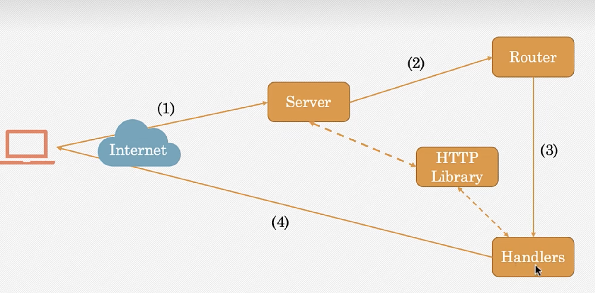

# class

## Step01 编写TCP Server和Client

std::net模块

标准库的std::net模块，提供网络的基本功能

支持TCP和UDP通信

TcpListener和TcpStream

Web Server

Server 

​	监听进来的TCP字节流

Router

​	接收HTTP请求，并决定调用哪个Handler

Handler

​	处理http请求，构建http响应

HTTP Libary

解释字节流，把它转化为HTTP请求

把HTTP响应转化为字节流

